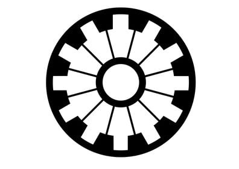
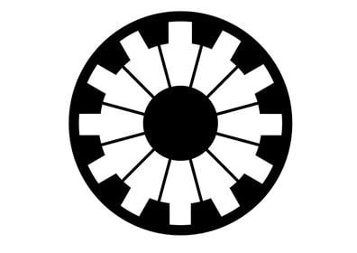
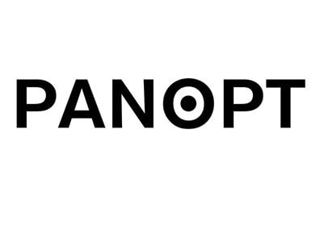
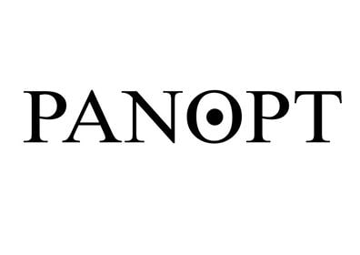
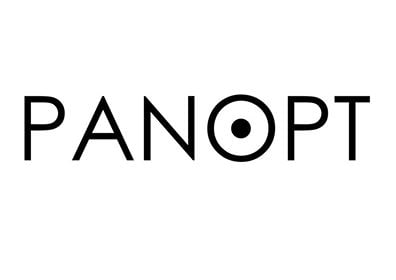

A logo design for the Yale-NUS newspaper, the erstwhile-titled "Panopt", whose name has since been changed to "The Octant".

The name for the magazine comes from Jeremy Bentham's Panopticon - a prison designed so that the warden was in the center of the prison. This allowed the warden sitting at the centre of the prison to effectively watch everyone in the prison at the same time. Terrible name for a newspaper? Possibly. Did I have a say in it? No. So let's crack on.

The idea started with a simplified diagram of the Panopticon.

The goal was to incorporate the design into the text somehow, effectively creating a logotype. I distilled the panopticon to its simplest form - a circle with a smaller circle in it - to suggest the visual identity of the panopticon, without being too literal about the whole thing. The next step was to pick the font.

Here I had some interesting choices. I narrowed it down to 3 - a sans-serif medium weight font, a more traditional newsy serif font and a light geometric font. Out of the three, the geometric font conveyed the idea clearest and was more modern to go with the modern nature of the newspaper and the content.