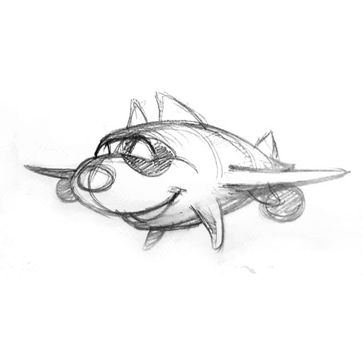
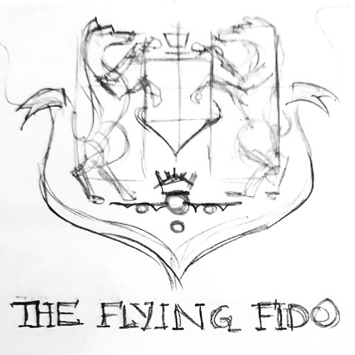
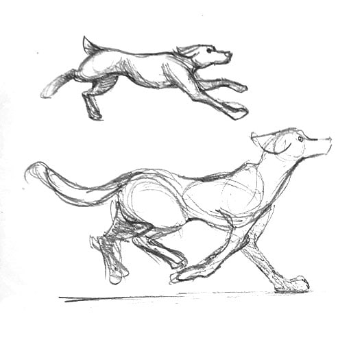
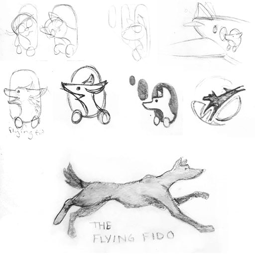
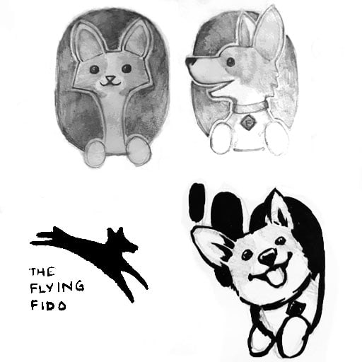

Possibly one of my favorite projects to work on in recent memory, The Flying Fido is a pet relocation service to help you transport your pets from one country to another, making the entire process hassle-free.

The logo went through various iterations, including superhero-dogs, dogs bounding out of boxes and even an aviator dogs. Ultimately I decided that it would be best for the dog to be riding pillion on this trip. The idea of a dog emerging out of a box or cage also seemed to suggest that it had been a box for the duration of the trip, which did not sound particularly inviting either. Ultimately, the inspiration came from the classic image of the dog sticking its head out of a car window, except the car was replaced with airplane windows - not a realistic depiction of airline travel perhaps, but sentiment-wise, it hit all the right notes.

As for the choice of dog, there were a lot of strong contenders - the owner's pug was one of them, but pugs are not necessarily adored by all. A shiba inu, or "doge", was another contender, but felt a little too meme-y and a look of bemused wonderment wasn't the emotion I was going for. In the end, I went with corgis, because in my opinion, they are the floofiest, and they generally have the expression of pure happiness and excitement that I was going for. They are also ideal candidates for being taken somewhere because their tiny little legs aren't going to carry them very far on their own.

Check out the website design [here](http://theflyingfido.com.sg/)