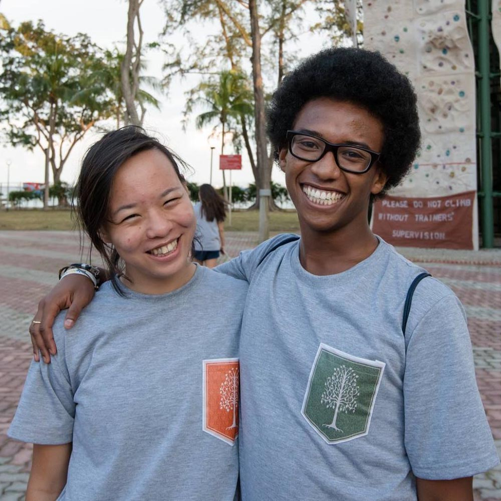
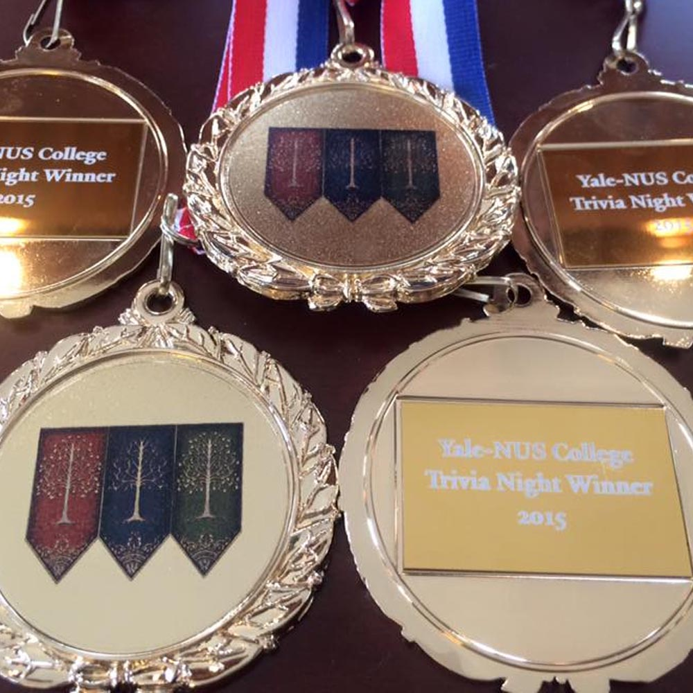
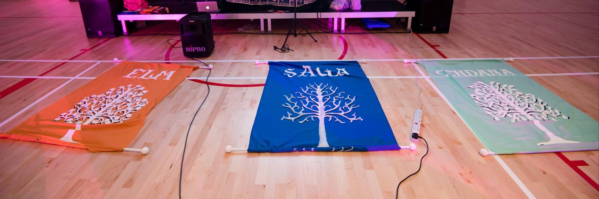

Yale-NUS College Orientations normally have a theme. My year was take flight, if memory serves. The year after that was 'Clash of Civilizations'. In the year of 2015, the theme was 'Clash of Seasons' (I'm personally still waiting for 'Clash of Clans' at some point). Anyway, there were 3 seasons assigned to the 3 Residential Colleges - Saga was Winter, Elm was Fall or Autumn, and Cendana was Spring, leaving out the only season it is in Singapore all the time - Summer.

In my mind, there were a few ways of approaching these designs, however the one I really wanted to go for was Medieval kingdom style coats of arms, almost like house banners from Game of Thrones. So I needed a tree that was ornate enough for the part - The Tree of Gondor was for me the correct amount of ornate, with its curly branches symmetrical designed look. This served as the starting point that would be common to all the three college banner designs. The color scheme was decided by the official residential college colors. Personally, my preference would have been black for winter, red for autumn and green for spring - but try arguing that with a committee and see how far that gets you.

